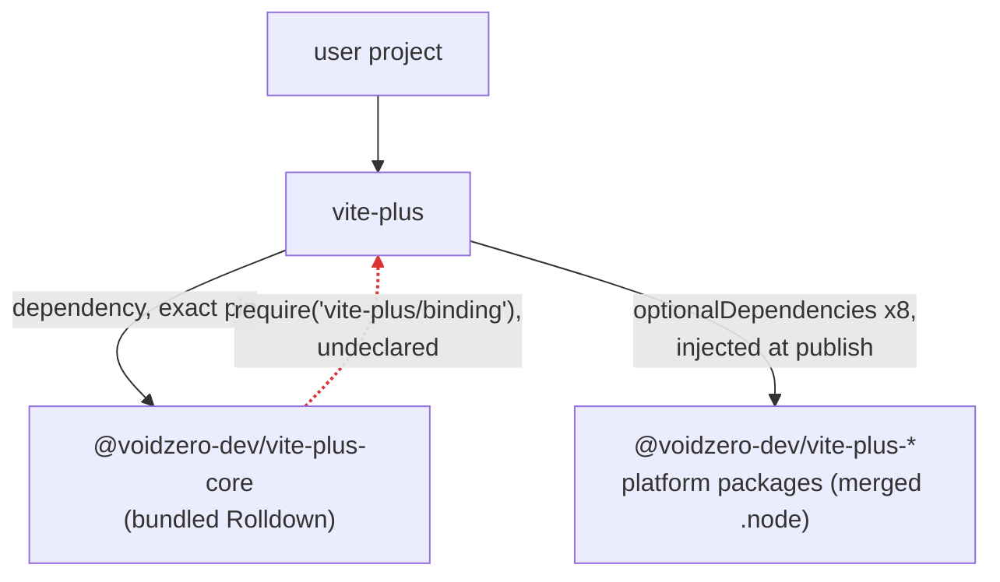
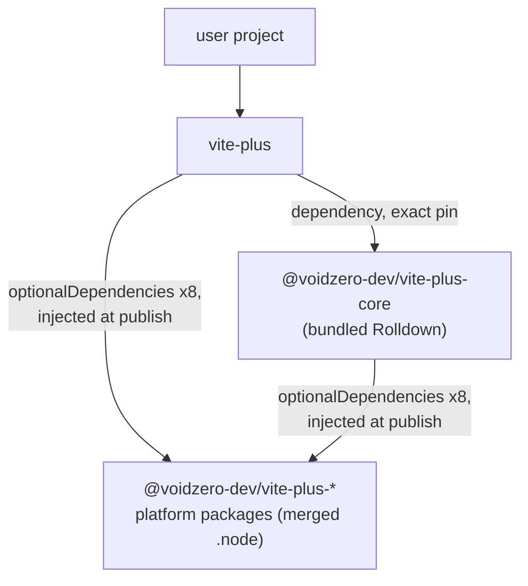

# RFC: Resolve Core's Rolldown Binding via Platform Packages

- Issue: [#2054](https://github.com/voidzero-dev/vite-plus/issues/2054)
- Supersedes: [#2067](https://github.com/voidzero-dev/vite-plus/pull/2067) (same rewrite direction, different version wiring)

## Problem

Release builds of `@voidzero-dev/vite-plus-core` collapse every `@rolldown/binding-*` require in bundled Rolldown's loader to `vite-plus/binding`. This breaks three ways:

1. Core never declares `vite-plus`, so the require resolves only through pnpm's hidden hoist and closes an undeclared cycle (`vite-plus -> core -> vite-plus/binding`). pnpm's `enable-global-virtual-store` and Yarn PnP enforce declared dependencies and fail with `Cannot find module 'vite-plus/binding'`. Repro: <https://github.com/jong-kyung/repro-vite-plus-2054>.
2. Core installed without `vite-plus` (the `"vite": "npm:@voidzero-dev/vite-plus-core@<version>"` alias) cannot load Rolldown at all.
3. The collapsed rewrite turns every version guard into `require('vite-plus/binding/package.json')`, which throws `ERR_PACKAGE_PATH_NOT_EXPORTED` (`vite-plus` exports no such subpath). Every platform branch fails, and the binding loads only through the rewritten WASI fallback, skipping the version check.

PR #2067 fixed 1-2 with a per-platform rewrite but committed exact-pinned platform `optionalDependencies` into `packages/core/package.json`. That fights the release model: `prepare_release.yml` bumps only `version` fields, `mergePackageJson()` plus the CI dirty-tree check fail on stale pins, the repo lockfile pulls published bindings into the dev workspace, and preview builds pin the previous release.

The pipeline already solves this for `vite-plus` itself: napi-rs `prePublish` injects the exact-pinned `@voidzero-dev/vite-plus-<platform>` entries at publish time, and the committed package.json carries none.

## Package graphs

Published release artifacts; solid edges are declared dependencies, dashed is the undeclared runtime require.

### Before

### After

No new packages, no cycle, and core works standalone. Package managers dedupe the shared platform package, so nothing downloads twice.

## Design

All changes apply to release artifacts; dev builds keep `@rolldown/binding-*` and load the `.node` embedded in dist.

1. **Per-platform rewrite** (`packages/core/build-support/rewrite-rolldown-binding.ts`): `@rolldown/binding-<suffix>` becomes `@voidzero-dev/vite-plus-<suffix>` for the suffixes derived from the CLI's `napi.targets` via napi-rs `parseTriple`. Requiring a platform package returns the merged `.node` via its `main`, the same shape as Rolldown's own binding packages. Other platforms (android, freebsd, `wasm32-wasi`, `darwin-universal`, the WebContainer fallback) stay on `@rolldown/binding-*`.
2. **Guard rewrite scoped to rewritten branches**: each loader branch pairs its require with a version guard (`bindingPackageVersion !== "<rolldown version>"`, enforced under `NAPI_RS_ENFORCE_VERSION_CHECK`). The transform rewrites the guard's expected version to core's version in one pattern anchored on the rewritten specifier, so untouched branches keep upstream guards and Rolldown's public `VERSION` export stays the Rolldown version. Platform packages publish lockstep with core, making the guard a real check again. The build fails if any published platform suffix misses its loader branch or the specifier and guard rewrites diverge, so a napi-rs loader format change cannot ship a partial rewrite.
3. **Publish-time optionalDependencies injection** (`packages/cli/publish-native-addons.ts`): after napi-rs `prePublish` injects the CLI's platform pins, mirror the identical entries into `packages/core/package.json`, failing if any target is missing. The script runs in both flows before core is packed: release (`--mode npm`, platform packages publish first so pins resolve) and registry-bridge preview (`--mode pkg-pr-new`, pins match the bridge-served versions). Nothing version-pinned lands in committed files.
4. **Stamp core's version in release builds** (`reusable-release-build.yml`): stamp `packages/core/package.json` to `VERSION` next to the existing CLI stamp so baked guard versions match the published platform packages. A no-op for releases, a fix for previews.
5. **Export removal**: the `vite-plus/binding` export existed only for the collapsed rewrite. Nothing imports the specifier (the CLI loads its binding relatively; no repo, dist, or ecosystem references), so the export is removed. Old published cores that require it always pair with an old `vite-plus` through the exact version pin, so removal cannot strand them.

Unchanged: dev builds, local registry and e2e (they install dev-built core), `prepare_release.yml`, `mergePackageJson()`, the repo lockfile.

## Alternatives

- **Committed pins (PR #2067)**: needs a release-time re-pin step, lockfile entries, and a pins-match-version test only to compensate for committing values the publish pipeline already knows.
- **Neutral loader package `@voidzero-dev/vite-plus-binding`**: cleanest graph and native napi-rs injection, but a ninth lockstep package plus relocating the napi packaging out of `packages/cli/binding/`, which the local CLI, bootstrap, pack-local, and preview flows all depend on. Buys no resolution property that declaring the existing platform packages lacks; revisit if a third package ever needs the binding.
- **Optional peer on `vite-plus` (#2053)**: declares the cycle instead of removing it; standalone core stays broken.
- **Ship the `.node` inside release core**: duplicates the native addon the platform packages exist to deduplicate.

## Testing

1. Unit tests for the transform against a captured loader excerpt: supported branches rewritten (specifier plus guard), unsupported and WASI branches untouched, stable on a second pass.
2. The publish script fails when the injected pins do not cover every `napi.target`.
3. Layout resolution spec (`binding-resolution-layout.spec.ts`): rebuilds the global-virtual-store shape with stub packages and asserts the collapsed rewrite fails with `Cannot find module 'vite-plus/binding'` while the transform output resolves and its guard rejects a mismatched platform package. A PTY snapshot case cannot cover this: snapshot installs use dev-built core, which embeds the `.node` in dist and never takes the rewritten path.
4. Full-stack regression: install packed release artifacts into a project with `enable-global-virtual-store=true` and bundle through `@voidzero-dev/vite-plus-core/rolldown`. Meaningful only for `RELEASE_BUILD` artifacts, so it belongs in the preview pipeline. The repro from #2054 is the acceptance test.

Ships in a normal release; no consumer action.

## Open questions

1. Should napi-rs support injecting platform `optionalDependencies` into more than one package? Worth an upstream issue; it would replace the script-side mirror in Design 3.
2. Where the layout regression test runs: preview pipeline (proposed), a release-PR preflight, or an opt-in `RELEASE_BUILD=1` e2e leg.
