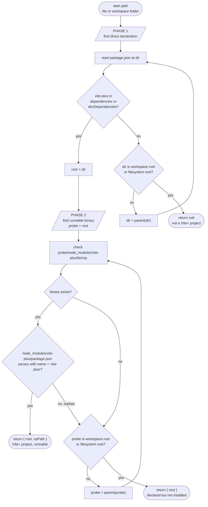

# RFC: Vite+ Project Detection for Editor Extensions

> Tracking issue: [#1557](https://github.com/voidzero-dev/vite-plus/issues/1557)
> Status: **Draft for discussion** — not yet a final design.

## Summary

Define a single, portable rule that the four oxc editor extensions —
`oxc-vscode`, `oxc-zed`, `oxc-intellij-plugin`, `coc-oxc` — can use to
answer: _"Given this workspace folder, is it part of a Vite+ project?"_
The rule decides whether the extension should launch `vp lint --lsp` /
`vp fmt --lsp` (instead of plain `oxlint` / `oxfmt`) and which executable
path to spawn.

**The rule, in one sentence:**
A workspace is a **Vite+ project** iff some walked-up `package.json`
declares `vite-plus` directly in `dependencies` or `devDependencies`,
up to the workspace root. The binary path to spawn (`vp`) and the
installed `vite-plus` version are then resolved separately by walking
up looking for a real, validated `node_modules/vite-plus/` install
inside the workspace; the version lets editors gate `vp lint --lsp`
behind a minimum release and keep the legacy `bin/oxlint` wrapper
path working for users still on older `vite-plus`.

**Distribution.** For the two Node-capable consumers (`oxc-vscode` and
`coc-oxc`), the detector ships as a published npm package
(`@voidzero-dev/detect-vite-plus`, name TBD) so both extensions consume
one tested implementation. `oxc-zed` (Rust/WASM) and
`oxc-intellij-plugin` (Kotlin) cannot import an npm package; they port
the same algorithm against the shared conformance fixtures.

## Motivation

Issue #1557 deprecates the per-package `bin/oxlint` and `bin/oxfmt`
wrappers that `vite-plus` ships today
(`packages/cli/bin/oxlint`, `packages/cli/bin/oxfmt`). Editor extensions
currently lean on those wrappers — the package manager installs them
into `node_modules/.bin/`, so the same `findBinary("oxlint")` code path
that works for a plain oxlint project automatically picks up the
`vite.config.ts`-aware wrapper for a Vite+ project. Once the wrappers
go away, that implicit handoff breaks: each extension must explicitly
notice "this is a Vite+ project" and launch `vp lint --lsp` /
`vp fmt --lsp` instead.

Without a shared rule, each extension reinvents it. Today the four
extensions have four different stories:

- `oxc-zed` (`src/lsp.rs:28`) loops over `[package_name, "vite-plus"]`
  in `package.json` deps and, on match, points at
  `node_modules/vite-plus/bin/oxlint` (the wrapper that #1557
  deprecates).
- `oxc-intellij-plugin` has a dedicated
  `viteplus/VitePlusPackage.kt` that resolves `vite-plus` via
  IntelliJ's Node package descriptor and returns
  `<vite-plus>/bin/oxlint`.
- `oxc-vscode` (`client/findBinary.ts:96, 208`) has comments
  acknowledging the Vite+ case but no explicit detection; it relies on
  `node_modules/.bin/oxlint` being the wrapper bin.
- `coc-oxc` (`src/common.ts:30`) has no Vite+ awareness at all.

## Insight

The strongest signal of "this project uses Vite+" is a **direct
dependency declaration** in a walked-up `package.json`. Everything
else — a `node_modules/vite-plus/` directory, a `vp` on `$PATH`, a
configured `binPath` setting — is either ambiguous (transitive
hoisting from an unrelated dependency tree) or unrelated to this
workspace's intent.

Once intent is established, locating the runnable `vp` binary is a
separate concern. Each extension already knows how to walk
`node_modules` from a workspace root for `oxlint`/`oxfmt`; the same
machinery, restricted to the workspace boundary and validated against
`vite-plus`'s own `package.json`, produces the launchable executable.

Splitting identity from launchability also gives editors a clean way
to handle freshly cloned, not-yet-installed projects: the detector
reports "Vite+ but not yet runnable" and the editor falls back to
plain oxlint/oxfmt instead of guessing at a global `vp`.

## How each extension resolves a CLI today

The four extensions all converge on roughly the same pattern, with
different fallbacks.

### `oxc-vscode` — `client/findBinary.ts`

```
1. settingsBinary (user-configured `oxc.<tool>.binPath`)
   → searchSettingsBin()
2. node_modules/.bin/<name> in every workspace folder
   → searchProjectNodeModulesBin() → searchNodeModulesDefaultBinPath()
3. node_modules/.bin/<name> from every nested package.json found in the workspace (monorepo)
4. require.resolve(<name>) anchored at workspace folders, then walk up to package.json#bin
   → replaceTargetFromMainToBin()
5. Yarn PnP: load `.pnp.cjs` / `.pnp.js`, call `resolveRequest(<name>, …)`
   → findPnpApi(), searchYarnPnpBin()
6. Global node_modules from `npm root -g`, `pnpm root -g`, `~/.bun/install/global/node_modules`
   → searchGlobalNodeModulesBin()
7. $PATH
   → searchEnvPath()
```

The whole chain returns a `BinarySearchResult` with `{path, loader, yarnPnpLoaderPath?}`.

### `coc-oxc` — `src/common.ts:23`

```ts
function findBinary(config: ClientConfig): Optional<string> {
  const cfg = workspace.getConfiguration(`oxc.${config.name}`);
  let bin = cfg.get<string>('binPath', '');
  if (bin && existsSync(bin)) return bin;
  bin = join(workspace.root, 'node_modules', '.bin', config.name);
  return existsSync(bin) ? bin : null;
}
```

User setting → workspace `node_modules/.bin/<name>`. That's it.

### `oxc-zed` — `src/lsp.rs`

```rust
fn get_workspace_exe_path(&self, worktree: &Worktree) -> Result<Option<PathBuf>> {
    let package_json = worktree.read_text_file("package.json")
        .unwrap_or(String::from(r#"{}"#));
    let package_json: Option<Value> = from_str(&package_json).ok();
    let package_name = self.get_package_name();           // "oxlint" or "oxfmt"
    let workspace_root = Path::new(worktree.root_path().as_str());

    for package_dir in [package_name.as_str(), "vite-plus"] {
        if package_json.as_ref().is_some_and(|p| package_exists(p, package_dir)) {
            return self.get_exe_path_from(workspace_root, package_dir, package_name.as_str()).map(Some);
        }
    }
    Ok(None)
}
```

Zed reads `package.json` at the worktree root (Zed's WASM API cannot
list arbitrary `node_modules` contents — see zed#10760), checks deps
for `oxlint`/`oxfmt` first then falls back to `vite-plus`, and
constructs `node_modules/<package_dir>/bin/<exe>`. Crucially Zed
_avoids_ `node_modules/.bin` because pnpm stores shell-script shims
there (see `lsp.rs:47`).

### `oxc-intellij-plugin` — `viteplus/VitePlusPackage.kt`

```kotlin
fun getPackage(virtualFile: VirtualFile?): NodePackage? {
    // NodePackageDescriptor("vite-plus").listAvailable(...)
    // or .findUnambiguousDependencyPackage(project)
    // or NodePackage.findDefaultPackage(...)
}
fun findOxlintExecutable(virtualFile: VirtualFile): String? {
    val pkg = getPackage(virtualFile) ?: return null
    val path = pkg.getAbsolutePackagePathToRequire(project) ?: return null
    return Paths.get(path, "bin/oxlint").toString()
}
```

IntelliJ already has a dedicated `VitePlusPackage` class that locates
the `vite-plus` package via the IDE's Node descriptor and returns
`<vite-plus>/bin/oxlint` or `<vite-plus>/bin/oxfmt`. This is the
strongest existing precedent for the "vp binary as marker" model.

### Common shape

Despite the different surface areas, every extension's resolution chain
includes one or more of:

- a **user-configured override** path (highest priority);
- a **workspace `node_modules` lookup** for the target package;
- an optional **`require.resolve` / IDE-package-descriptor** fallback;
- (some) **PnP / global / `$PATH`** fallbacks.

What we standardize is **what target name** they look up, not _how_
they look it up.

## The canonical rule

The detector answers two separable questions:

1. **Is this a Vite+ project?** — answered solely by **direct
   declaration** of `vite-plus` in some walked-up `package.json`'s
   `dependencies` or `devDependencies`, up to and including the
   workspace root. Nothing else qualifies. The presence of a
   `node_modules/vite-plus/` directory alone does not — that could be
   a transitive install from an unrelated dependency.
2. **Where do I spawn `vp` from?** — answered only after question 1
   is positive, by walking up from the declaring `package.json` and
   looking for a real `node_modules/vite-plus/bin/vp` at any ancestor
   inside the workspace boundary.

```
fn detect_vite_plus_project(start: AbsolutePath) -> Option<DetectResult>:
    # Phase 1: find the owning package.json that DIRECTLY declares vite-plus.
    declaration_root = walk_up_until_workspace_root(start, |dir, pkg|:
        if pkg?.dependencies?.["vite-plus"] || pkg?.devDependencies?.["vite-plus"]:
            return Some(dir)
        else:
            return None
    )
    if declaration_root is None:
        return None  # Not a Vite+ project.

    # Phase 2: resolve the runnable binary, scoped to the workspace.
    vp_path = walk_up_until_workspace_root(declaration_root, |dir, _|:
        if is_valid_vite_plus_install(dir):
            return Some(dir / "node_modules" / "vite-plus" / "bin" / "vp")
        else:
            return None
    )

    return Some({ root: declaration_root, vp_path })  # vp_path may be None
```

The walk-up in both phases stops AT the workspace root
(`pnpm-workspace.yaml`, `package.json#workspaces`, or `lerna.json`)
and never crosses into its parent.

### Workspace root markers

A directory is a workspace root if **any** of the following is true:

1. It contains a `pnpm-workspace.yaml` file.
2. It contains a `package.json` whose top-level `workspaces` field is
   present (covers npm, Yarn classic, Yarn Berry, and Bun workspaces,
   all of which encode their workspace globs through this field).
3. It contains a `lerna.json` file.

This set mirrors `findWorkspaceRoot` in
`packages/cli/src/resolve-vite-config.ts:45` of the `vite-plus`
TypeScript codebase, which is the canonical reference for the editor
extensions.

**Known parity gap with `vite-task`.** The Rust implementation at
`vite-task/crates/vite_workspace/src/package_manager.rs:135`
(`find_workspace_root`) currently recognizes only the first two
markers and carries a `TODO(@fengmk2): other package manager support`
for Lerna. We leave the broader set in this RFC because the editor
extensions follow the TS convention; aligning `vite-task` is a
follow-up that does not block this RFC. Lerna projects that hit this
gap today already exercise the same `vp` runtime behaviour, so no
user-visible regression is introduced by the editor extensions
adopting the broader set.

**Deliberately not in v1**: `deno.json` workspaces, `.git` directory,
and incidental vite-plus artifacts such as the `.vite-hooks` directory
(`packages/cli/src/config/hooks.ts:67`) — these are not workspace
roots and the walk must continue past them. If a future deliverable
adds a new marker, update this list and the conformance fixtures
together.

### Algorithm diagram

Renders natively on GitHub; useful as a language-agnostic reference
for the Rust and Kotlin ports.



Reading the diagram:

- The two phases run in sequence; Phase 2 only starts after Phase 1
  produces a `root`.
- Each phase is a bounded walk-up. The bound is the workspace root —
  whichever ancestor first satisfies one of `pnpm-workspace.yaml`,
  `package.json#workspaces`, or `lerna.json`. The walk evaluates that
  directory once and then stops; it does not cross into the parent.
- The three terminal nodes (rounded) are the three observable
  outcomes the conformance fixtures pin down.

### Result shape

```
DetectResult {
    root:       AbsolutePath,
    vp_path:    Option<AbsolutePath>,
    vp_version: Option<String>,        // set iff vp_path is set
}
```

Three outcomes:

- **`None`** — no walked-up `package.json` declares `vite-plus`. Not a
  Vite+ project. Editor uses plain `oxlint` / `oxfmt`.
- **`Some({ root, vp_path: Some(...), vp_version: Some(...) })`** —
  Vite+ project, installed. The editor compares `vp_version` against
  a minimum known to support `vp lint --lsp` (see "Version-gated LSP
  support" below) and either launches `<vp_path> lint --lsp` /
  `<vp_path> fmt --lsp` or falls back to the legacy
  `bin/oxlint`/`bin/oxfmt` wrapper path.
- **`Some({ root, vp_path: None, vp_version: None })`** — Vite+
  project declared but not installed (fresh clone, pre-`pnpm install`,
  Berry PnP without `node_modules`, or a broken install). Editor
  should **not** launch `vp` — there is no project-scoped binary to
  spawn, and falling back to a bare `vp` from `$PATH` would
  re-introduce the global-leakage hole. Recommended UX: fall back to
  plain `oxlint` / `oxfmt`, optionally surface a hint like "Vite+
  detected — run `pnpm install` to enable Vite+ LSP."

### Validity check on the install

When Phase 2 finds a `bin/vp`, it also requires
`node_modules/vite-plus/package.json` to parse, have
`name === "vite-plus"`, and carry a string `version`. The version
string is returned in the result; orphan trees (missing
`package.json`, wrong name, missing or non-string version) are
treated as "not installed" and Phase 2 keeps walking up.

### Version-gated LSP support

`vp lint --lsp` and `vp fmt --lsp` only exist on `vite-plus` versions
that ship after the `bin/oxlint` / `bin/oxfmt` wrappers are
deprecated (#1557). Older installed versions still rely on the
wrappers. The detector returns `vp_version` so each consumer can
decide which mode to use:

```
if vp_version is None:
    use plain oxlint/oxfmt (declared-but-not-installed case)
elif vp_version >= MIN_VP_VERSION_FOR_LSP:
    launch vp lint --lsp / vp fmt --lsp
else:
    fall through to the existing findBinary(oxlint/oxfmt) chain,
    which picks up the legacy bin/oxlint wrapper.
    Optionally surface a "Vite+ detected — upgrade vite-plus to
    enable native LSP" hint.
```

`MIN_VP_VERSION_FOR_LSP` is the first `vite-plus` release that ships
`vp lint --lsp` / `vp fmt --lsp` and drops the `bin/oxlint` /
`bin/oxfmt` wrappers. The exact value is **TBD** — it gets filled in
when #1557 lands. The shared TypeScript package exports it as a
constant plus a `supportsLsp(version)` helper so both consumers
agree.

This rollout is robust in both directions:

- **Old vite-plus + new editor extension** → detector reports an old
  version → editor falls through → `findBinary("oxlint")` resolves
  the legacy wrapper bin → user gets Vite-config-aware linting via
  the wrapper, as today.
- **New vite-plus + new editor extension** → detector reports a
  supported version → editor launches `vp lint --lsp` directly.
- **New vite-plus + old editor extension (no detector yet)** → the
  old extension keeps probing `bin/oxlint`; if the new vite-plus has
  removed the wrappers, the extension falls back to whatever its
  global oxlint path resolves to. Not ideal, but the upgrade hint
  drives users to upgrade their extension.

### Why this rule

- **Direct declaration is unambiguous user intent.** A `dependencies`
  or `devDependencies` entry is the only filesystem artifact that says
  _"this project chose to use vite-plus."_ Everything else
  (`node_modules/vite-plus/` from hoisting, `vp` on `$PATH`, global
  installs, user settings, orphan files) is incidental and can lie.
- **Transitive installs are rejected by construction.** Phase 1 only
  reads `package.json` of walked-up ancestors; a `vite-plus` package
  hoisted into a node_modules from someone else's dependency tree
  never gets checked.
- **The workspace boundary is the trust boundary.** Both phases stop
  at the workspace root marker, so a nested checkout cannot inherit a
  Vite+ install from its outer parent directory.
- **Launchability is reported separately from project identity.** The
  editor knows precisely when to launch `vp` and when to fall back,
  without conflating "no Vite+" with "Vite+ but not yet installed."

### What we deliberately do **not** check

- `vite.config.ts` / `vite-task.json` — exist in plain-Vite projects.
- `.oxlintrc.json` / `.oxfmtrc.json` — exist in plain-oxlint projects.
- `node_modules/.bin/oxlint` being the wrapper bin — #1557 deletes those.
- A globally-installed `vp` on `$PATH`, a `vp` in the user's global
  `node_modules`, or a user-configured `oxc.<tool>.binPath`. None of
  these tell us anything about whether _this workspace_ uses Vite+.
- `require.resolve("vite-plus")` — Node's resolution algorithm walks
  past the workspace root and can find an unrelated parent install.
  We use direct directory probes that are explicitly bounded.
- A `node_modules/vite-plus/` directory that doesn't itself appear as
  a direct dep in some walked-up `package.json`. Transitive installs
  do not count.
- A `node_modules/vite-plus/` directory whose `package.json` is
  missing, unparseable, or has `name !== "vite-plus"`. Orphan trees
  do not count.
- Any ancestor above the workspace root. The walk stops there.

## TypeScript helper package

`oxc-vscode` and `coc-oxc` consume a published npm package
(proposed name **`@voidzero-dev/detect-vite-plus`**) rather than
hand-rolling the two-phase walk. One source of truth, one set of
tests, one bug fix flows to both extensions.

**Why a package, not vendored snippets.** The detector's logic is now
non-trivial: two phases, tri-state result, workspace-root detection,
install validation, walk-up bounds. Two independent copies would
drift on edge cases (validation, error handling, walk-up
termination). The cost of a shared dependency is lower than the cost
of two implementations subtly diverging.

**Package constraints:**

- Lives at `packages/detect-vite-plus/` inside this monorepo;
  independent versioning via the existing changesets workflow.
- Zero runtime dependencies — Node built-ins only (`node:fs`,
  `node:path`).
- Dual ESM + CJS publish so both `oxc-vscode` and `coc-oxc`
  toolchains can consume it.
- No process spawns, no network, no NAPI binding — pure JS.
- Stable, semver-versioned API. Once 1.0 ships, breaking changes
  require a major bump because two editor extensions pin it.
- Target install footprint: under 10 KB unpacked.

**Public API** (sync + async):

```ts
export interface DetectResult {
  root: string;
  vpPath?: string;
  vpVersion?: string;
}
export function detectVitePlusProject(start: string): Promise<DetectResult | null>;
export function detectVitePlusProjectSync(start: string): DetectResult | null;

/**
 * First vite-plus version that ships `vp lint --lsp` and drops the
 * legacy `bin/oxlint` / `bin/oxfmt` wrappers. Updated when #1557 lands.
 */
export const MIN_VP_VERSION_FOR_LSP: string;
export function supportsLsp(version: string | undefined): boolean;
```

`oxc-vscode` prefers the async variant to avoid extension-host
stalls; `coc-oxc`'s startup path uses the sync variant. The package
exposes both.

**The reference implementation below is the package source.** It is
also the spec for `oxc-zed` (Rust port) and `oxc-intellij-plugin`
(Kotlin port), which cannot consume the npm package. The conformance
fixture table at the end of this RFC binds all three implementations
to the same observable behaviour.

The snippet uses the sync variant for readability. The async variant
is the same algorithm with `fs.promises`.

```ts
import { existsSync, readFileSync } from 'node:fs';
import { dirname, join } from 'node:path';

export interface DetectResult {
  /** Workspace ancestor whose package.json directly declares vite-plus. */
  root: string;
  /**
   * Absolute path to a runnable, project-scoped vp binary, when one
   * is installed inside the workspace. Undefined when vite-plus is
   * declared but not yet installed (pre-`pnpm install`, Berry PnP
   * without node_modules, broken install). Callers MUST NOT launch
   * `vp` when this is undefined.
   */
  vpPath?: string;
  /**
   * The installed vite-plus's `package.json#version`. Set whenever
   * vpPath is set. Compare against MIN_VP_VERSION_FOR_LSP (or use
   * `supportsLsp`) to decide between `vp lint --lsp` and the legacy
   * bin/oxlint wrapper path.
   */
  vpVersion?: string;
}

function readPackageJson(dir: string): any | null {
  try {
    return JSON.parse(readFileSync(join(dir, 'package.json'), 'utf8'));
  } catch {
    return null;
  }
}

function isWorkspaceRoot(dir: string, pkg: any | null): boolean {
  if (existsSync(join(dir, 'pnpm-workspace.yaml'))) return true;
  if (existsSync(join(dir, 'lerna.json'))) return true;
  return Boolean(pkg?.workspaces);
}

function declaresVitePlus(pkg: any | null): boolean {
  return Boolean(pkg?.dependencies?.['vite-plus'] || pkg?.devDependencies?.['vite-plus']);
}

/**
 * `bin/vp` must exist AND `node_modules/vite-plus/package.json` must
 * parse, identify itself as `vite-plus`, and carry a string version.
 * Rejects orphan trees left behind by partial uninstalls.
 */
function resolveVpAt(dir: string): { vpPath: string; vpVersion: string } | null {
  const vpPath = join(dir, 'node_modules', 'vite-plus', 'bin', 'vp');
  if (!existsSync(vpPath)) return null;
  try {
    const pkg = JSON.parse(
      readFileSync(join(dir, 'node_modules', 'vite-plus', 'package.json'), 'utf8'),
    );
    if (pkg?.name !== 'vite-plus' || typeof pkg?.version !== 'string') return null;
    return { vpPath, vpVersion: pkg.version };
  } catch {
    return null;
  }
}

export function detectVitePlusProjectSync(start: string): DetectResult | null {
  // Phase 1: find the package.json that directly declares vite-plus.
  let dir = start;
  let root: string | null = null;
  let rootPkg: any | null = null;
  while (true) {
    const pkg = readPackageJson(dir);
    if (declaresVitePlus(pkg)) {
      root = dir;
      rootPkg = pkg;
      break;
    }
    if (isWorkspaceRoot(dir, pkg)) break;
    const parent = dirname(dir);
    if (parent === dir) break;
    dir = parent;
  }
  if (!root) return null;

  // Phase 2: walk up from the declaring root looking for a real install,
  // bounded by the workspace root. Reuses Phase 1's package.json read at
  // `root` so the boundary check on the first iteration doesn't repeat I/O.
  let probe: string | null = root;
  let pkg = rootPkg;
  while (probe) {
    const installed = resolveVpAt(probe);
    if (installed) return { root, ...installed };
    if (isWorkspaceRoot(probe, pkg)) break;
    const parent = dirname(probe);
    if (parent === probe) break;
    probe = parent;
    pkg = readPackageJson(probe);
  }

  return { root };
}
```

## Per-extension migration plan

Each extension runs the two-phase detector **before** its existing
oxlint/oxfmt lookup. The detector replaces, rather than extends, any
generic bin-resolution chain when the target is `"vp"`:

- `null` → fall through to the existing oxlint/oxfmt chain.
- `{ root, vpPath, vpVersion }` with `supportsLsp(vpVersion)` →
  launch `<vpPath> lint --lsp` (or `fmt --lsp`).
- `{ root, vpPath, vpVersion }` with version too old → fall through
  to the existing chain (which resolves the legacy
  `bin/oxlint`/`bin/oxfmt` wrapper still shipped by that vite-plus
  version). Optionally surface an upgrade hint.
- `{ root, vpPath: undefined }` → fall through to the existing
  oxlint/oxfmt chain; optionally surface a "Vite+ detected — run
  install to enable LSP" hint. Do **not** launch a bare `vp`.

### `oxc-vscode`

Add `@voidzero-dev/detect-vite-plus` as a **devDependency** — the
extension bundles it via its existing build step into the shipped
`.vsix`, so it does not appear at runtime in the extension's
`node_modules`. Call `detectVitePlusProject(workspaceFolder.fsPath)`
before invoking the existing `findBinary("oxlint" | "oxfmt", ...)`
chain. The existing chain is unchanged and only consulted when the
detector returns `null` or a declared-but-not-installed result. Do
**not** parameterize the existing `findBinary` with `"vp"` as a
target — the chain's `searchSettingsBin`,
`searchGlobalNodeModulesBin`, `searchEnvPath`, and `require.resolve`
paths can escape the workspace boundary or consult settings meant for
oxlint/oxfmt.

### `coc-oxc`

Add `@voidzero-dev/detect-vite-plus` as a **devDependency** — bundled
into the published artifact (coc-oxc already builds via Vite per its
existing `vite.config.ts`), not present at runtime in the user's
`node_modules`. Call `detectVitePlusProjectSync(workspace.root)` from
`findBinary()` before the `node_modules/.bin` lookup. Skip
`oxc.<tool>.binPath` for `vp` (that setting targets oxlint/oxfmt).

### `oxc-zed`

Zed already reads the worktree's `package.json` at
`get_workspace_exe_path` (`src/lsp.rs:19-40`); it just needs the
two-phase logic ported into Rust:

- **Phase 1** (declaration): the existing
  `[package_name, "vite-plus"]` loop becomes a single
  `package_exists(p, "vite-plus")` check on `dependencies` /
  `devDependencies`. If absent, return `Ok(None)` and Zed's existing
  oxlint/oxfmt path runs unchanged.
- **Phase 2** (binary): when declared, probe
  `<worktree>/node_modules/vite-plus/bin/vp` and validate
  `<worktree>/node_modules/vite-plus/package.json` (`name ===
"vite-plus"`). If valid, return the path; otherwise return `None`
  for "declared but not installed."

Update `language_server_command` to pass `["lint", "--lsp"]` /
`["fmt", "--lsp"]` when launching `vp`. Zed's WASM API today only
reads the worktree root, so deeper walk-up isn't currently
expressible — that's a known limitation worth noting in the Zed PR
but doesn't block this RFC.

### `oxc-intellij-plugin`

`VitePlusPackage.kt` already locates `vite-plus` via IntelliJ's
`NodePackageDescriptor`, which is project-scoped. Tighten it to
require `vite-plus` to appear as a **direct** dependency of the
project's `package.json` (IntelliJ's package descriptor exposes
direct vs. transitive). Change the returned path from
`<vite-plus>/bin/oxlint` to `<vite-plus>/bin/vp` and update launch
args to `lint --lsp` / `fmt --lsp`. When the descriptor finds the
declaration but no installed package, fall back to plain
oxlint/oxfmt; do not launch a bare `vp`.

## Decisions

### Publish a shared TypeScript helper for the Node consumers

Locked. The detector ships as
`@voidzero-dev/detect-vite-plus` (name TBD) and the two Node-capable
extensions (`oxc-vscode`, `coc-oxc`) depend on it directly. Two
benefits over vendored copies: bug fixes flow to both extensions
through a normal version bump, and the conformance fixtures only need
to be exercised once in this repo's CI to guarantee parity. `oxc-zed`
(Rust) and `oxc-intellij-plugin` (Kotlin) cannot consume an npm
package; they port the same algorithm against the shared conformance
fixtures, which is reasonable because each is already non-trivial
work in those repos.

### Direct declaration in `package.json` is the only project-identity signal

Locked. A project is Vite+ iff some walked-up `package.json` lists
`vite-plus` in `dependencies` or `devDependencies` directly. The
binary's mere presence in `node_modules` does **not** qualify — a
transitive install hoisted by a package manager would otherwise
misclassify unrelated projects. Replaces an earlier "hybrid
two-signal" design that treated `bin/vp` existence as an independent
positive signal.

### Binary resolution is a separate, project-scoped question

Locked. Once declared, we look for `node_modules/vite-plus/bin/vp` by
walking up from the declaring ancestor and never crossing the
workspace root. We never call `require.resolve` (Node's resolution
algorithm walks past the workspace root and would re-open the
nested-repo leakage hole). We do not consult `$PATH`, the user's
global `node_modules`, or `oxc.<tool>.binPath` (which targets
oxlint/oxfmt, not vp).

### Tri-state result, not boolean

Locked. The "declared but not installed" state is reported
separately from "not Vite+" so editors can distinguish a fresh clone
from a non-Vite+ project — and so they never launch a bare `vp` they
would have to find on `$PATH`.

### Valid `vite-plus` install required before accepting `bin/vp`

Locked. `node_modules/vite-plus/package.json` must parse, have
`name === "vite-plus"`, and carry a string `version`. Orphan `bin/vp`
files (partial uninstall, hand-crafted directories, stale caches) are
treated as "not installed" and Phase 2 keeps walking up.

### Report the installed vite-plus version

Locked. The detector returns `vpVersion` from the installed
`node_modules/vite-plus/package.json` so consumers can gate
`vp lint --lsp` behind a minimum supported version. This keeps the
rollout backwards-compatible: editors upgraded to use this detector
correctly handle workspaces still pinned to older `vite-plus`
versions that ship the `bin/oxlint` wrapper, and can surface an
"upgrade `vite-plus` to enable native LSP" hint when appropriate.
The threshold (`MIN_VP_VERSION_FOR_LSP`) lives in the shared
detector package and is updated when #1557's removal of the
wrappers lands.

### Workspace-wide granularity

If any ancestor up to the workspace root declares `vite-plus`, the
entire workspace is Vite+. Editor LSPs operate at workspace
granularity; per-package granularity would surprise users by toggling
LSP behaviour as they move between folders.

### Avoid `node_modules/.bin/vp` in the reference and in Zed

Mirroring oxc-zed's choice (`lsp.rs:47`): point at
`<root>/node_modules/vite-plus/bin/vp`, not `node_modules/.bin/vp`,
because pnpm stores shell-script shims in `.bin` that don't behave
like real Node binaries when invoked headlessly.

### Yarn PnP

Berry with PnP has no `node_modules`. Phase 1 still finds the
declaration in `package.json`. Phase 2 fails to resolve a binary →
the detector returns `{ root }` (declared but not installed from the
detector's perspective). For v1, the editor falls back to plain
oxlint/oxfmt in this case. PnP-aware binary resolution is a v2
extension that would plug into Phase 2 only.

### Walk stops at the workspace root

Locked. A nested checkout placed under a parent directory that
happens to have its own `vite-plus` install must not inherit Vite+
behaviour from that unrelated workspace.

## Downstream coordination

**In this repo (lands first):**

- `packages/detect-vite-plus/` — publish
  `@voidzero-dev/detect-vite-plus` (sync + async API, ESM + CJS,
  zero deps). The reference snippet above is the package source.
- Conformance test suite running the package against every fixture
  in the table below.

**Downstream PRs** (each extension owns its own repo and test
fixtures):

- `oxc-vscode` PR: add `@voidzero-dev/detect-vite-plus` as a
  devDependency (bundled into the `.vsix`); call it ahead of the
  existing `findBinary("oxlint" | "oxfmt")` chain; launch
  `vp lint --lsp` / `vp fmt --lsp` only when `vpPath` is set,
  otherwise fall through.
- `coc-oxc` PR: add `@voidzero-dev/detect-vite-plus` as a devDependency
  (bundled into the published artifact); call it from `findBinary()`
  before the `node_modules/.bin` lookup; same launch rule.
- `oxc-zed` PR: replace the `[package_name, "vite-plus"]` loop in
  `lsp.rs:28` with the two-phase check ported into Rust; return the
  `vp` path with args `["lint" | "fmt", "--lsp"]`. Fall back to
  oxlint/oxfmt when declared-but-not-installed. Replicate the
  conformance fixtures in the Zed PR's tests.
- `oxc-intellij-plugin` PR: keep `VitePlusPackage.kt`, tighten it to
  require `vite-plus` as a direct dep, change the returned path to
  `bin/vp`, and update launch args. Fall back to oxlint/oxfmt when
  declared but no installed package is found. Replicate the
  conformance fixtures in the IntelliJ PR's tests.

## Open questions

1. **`MIN_VP_VERSION_FOR_LSP`**. The concrete version of `vite-plus`
   at which the wrappers go away and `vp lint --lsp` becomes the
   supported entry point is TBD — it gets set when the corresponding
   `vite-plus` release ships. The detector package exports this as a
   constant; both consumers depend on the package picking up the
   value, so a version bump of the detector is what enables LSP for
   new users.
2. **Caching policy** in editor extensions — documented best-practice
   only, or also illustrated in the reference snippet (an opt-in
   memoizing variant with a watcher-invalidation hook)?
3. **Zed launch args plumbing.** The `--lsp` switch is already there
   for oxlint/oxfmt; for `vp` we need to pass `["lint", "--lsp"]` /
   `["fmt", "--lsp"]`. The Zed extension API accepts this via
   `Command { command, args, env }` — confirmed in `oxlint.rs:29-34`.
4. **"Declared but not installed" UX.** Should editors silently fall
   back to plain oxlint/oxfmt, or surface a notification prompting
   `pnpm install`? Proposal: silent fallback in v1, leave the UX
   decision to each extension.
5. **"Installed but not configured."** Should we additionally require
   `vite.config.ts` to exist? Proposal: **no**. A direct dep
   declaration is intent enough.

## Conformance fixtures

Every implementation must produce identical answers on the following
fixtures. Each extension replicates the set inside its own test suite.

`DetectResult` shape: `{ root: string, vpPath?: string, vpVersion?: string }`;
`null` means not a Vite+ project. Every fixture below also has an
implicit assertion: when `vpPath` is set, `vpVersion` must equal the
fixture's installed `node_modules/vite-plus/package.json#version`.

| Fixture                                 | Tree                                                                                                                                                                                     | Expected result                                                                                                                                 |
| --------------------------------------- | ---------------------------------------------------------------------------------------------------------------------------------------------------------------------------------------- | ----------------------------------------------------------------------------------------------------------------------------------------------- |
| `root-declared-and-installed`           | Root `package.json` declares `vite-plus` + `node_modules/vite-plus/bin/vp` + valid `node_modules/vite-plus/package.json` (`version: "<new>"`)                                            | `{ root: "<repo>", vpPath: "<repo>/node_modules/vite-plus/bin/vp", vpVersion: "<new>" }`; `supportsLsp(vpVersion) === true`                     |
| `installed-but-version-too-old`         | Same tree as `root-declared-and-installed` but with an older `vite-plus` version that pre-dates `vp lint --lsp`                                                                          | `{ root, vpPath, vpVersion: "<old>" }`; `supportsLsp(vpVersion) === false` — editor must fall through to legacy `bin/oxlint` chain              |
| `installed-no-version-field`            | Declared + `bin/vp` exists; `node_modules/vite-plus/package.json` is missing `version` or has it as a non-string                                                                         | `{ root: "<repo>" }` — install rejected, vpPath absent                                                                                          |
| `pnpm-subpackage-declared-root-hoisted` | `pnpm-workspace.yaml` at `<repo>`, root `package.json` does **not** declare `vite-plus`, `packages/app/package.json` declares it, install is hoisted to `<repo>/node_modules/vite-plus/` | From inside `packages/app/`: `{ root: "<repo>/packages/app", vpPath: "<repo>/node_modules/vite-plus/bin/vp", vpVersion: "<new>" }`              |
| `root-declared-no-install`              | Root `package.json` declares `vite-plus`, no `node_modules` (fresh clone)                                                                                                                | `{ root: "<repo>" }` — vpPath and vpVersion absent                                                                                              |
| `npm-package-installed-direct-dep`      | Root `package.json` with `workspaces`, `packages/app/package.json` declares `vite-plus`, install inside `packages/app/node_modules/vite-plus/` (un-hoisted)                              | From inside `packages/app/`: `{ root: "<repo>/packages/app", vpPath: "<repo>/packages/app/node_modules/vite-plus/bin/vp", vpVersion: "<new>" }` |
| `plain-non-vite-plus`                   | Normal Node project, no `vite-plus` anywhere                                                                                                                                             | `null`                                                                                                                                          |
| `plain-vite-no-vp`                      | Uses Vite (`vite` declared, `vite.config.ts` present) but does not declare `vite-plus`                                                                                                   | `null`                                                                                                                                          |
| `transitive-install`                    | No walked-up `package.json` declares `vite-plus`, but `node_modules/vite-plus/` exists as a transitive dep (pulled in by some other package)                                             | `null` — Phase 1 fails: no direct declaration                                                                                                   |
| `bin-vp-orphan-no-package-json`         | Declared in root `package.json`, but `node_modules/vite-plus/bin/vp` exists with no sibling `package.json`                                                                               | `{ root: "<repo>" }` — install rejected as orphan                                                                                               |
| `bin-vp-orphan-wrong-name`              | Declared in root `package.json`, `bin/vp` + `package.json` exist but `package.json` has `name !== "vite-plus"` or is unparseable                                                         | `{ root: "<repo>" }` — install rejected                                                                                                         |
| `parent-vite-plus-nested-repo`          | Outer dir declares `vite-plus` and has the install; inner subdirectory is its own workspace root (own `pnpm-workspace.yaml`/`package.json#workspaces`) and does not declare `vite-plus`  | From inside the nested workspace: `null` — Phase 1 stops at the inner workspace root                                                            |
| `global-vp-on-path`                     | Plain Node project, no declaration; `vp` is on `$PATH` and/or in the user's global `node_modules`                                                                                        | `null`                                                                                                                                          |
| `user-binpath-override`                 | Plain Node project, no declaration; `oxc.oxlint.binPath` configured to a `vp` binary                                                                                                     | `null`                                                                                                                                          |
| `yarn4-pnp`                             | Berry/PnP, no `node_modules`, root `package.json` declares `vite-plus`                                                                                                                   | `{ root: "<repo>" }` — declared, install not resolvable via plain filesystem walk                                                               |

## Verification plan

1. **Each downstream PR** replicates the fixture table above inside its
   own test suite and asserts the expected detector result.
2. **Manual editor smoke test** before each downstream PR is merged:
   point the extension at a real Vite+ project and at a plain-oxlint
   project; verify correct LSP routing in both.
