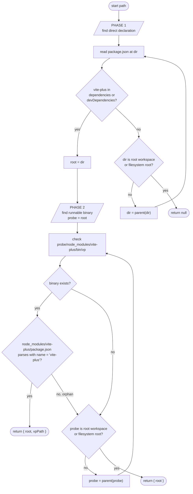

# RFC: Vite+ Project Detection for Editor Extensions

> Tracking issue: [#1557](https://github.com/voidzero-dev/vite-plus/issues/1557)
> Status: **Draft for discussion**

## Summary

Define a portable rule the four oxc editor extensions
(`oxc-vscode`, `oxc-zed`, `oxc-intellij-plugin`, `coc-oxc`) use to
decide whether to launch `vp lint --lsp` / `vp fmt --lsp` instead of
plain `oxlint` / `oxfmt`, and to locate the `vp` binary to spawn.

## Motivation

#1557 removes the `bin/oxlint` and `bin/oxfmt` wrappers that
`vite-plus` ships today (`packages/cli/bin/oxlint`,
`packages/cli/bin/oxfmt`). Editor extensions currently lean on those
wrappers being installed into `node_modules/.bin/` — the same
`findBinary("oxlint")` code path that works for a plain oxlint
project automatically picks up the `vite.config.ts`-aware wrapper for
a Vite+ project. Once the wrappers go away, that implicit handoff
breaks: each extension must explicitly notice "this is a Vite+
project" and launch `vp lint --lsp` / `vp fmt --lsp` instead.

Today each extension's idea of "is Vite+" differs — Zed checks
`package.json` deps and points at the wrapper bin
(`oxc-zed/src/lsp.rs:28`); IntelliJ has a dedicated
`VitePlusPackage.kt`; oxc-vscode and coc-oxc have no explicit
detection. The goal of this RFC is one rule, four implementations.

## The rule

A project is **Vite+** iff some `package.json` between the start
path and the root workspace declares `vite-plus` directly in
`dependencies` or `devDependencies`. A `node_modules/vite-plus/`
directory on its own does not qualify — that could be a transitive
install hoisted from an unrelated dependency tree.

> _"Root workspace"_ in this RFC means the **monorepo root** — the
> directory containing `pnpm-workspace.yaml`,
> `package.json#workspaces`, or `lerna.json`. It is **not** the
> editor's "workspace folder" (the folder a user opens in VS Code,
> Zed, etc.). The two concepts are distinct: a single editor
> workspace folder may sit at, inside, or alongside a root workspace.

The runnable `vp` binary is resolved separately: walk up from the
declaring ancestor for `node_modules/vite-plus/bin/vp` with a sibling
`package.json` that parses and has `name === "vite-plus"`, bounded by
the root workspace.

```
fn detect_vite_plus_project(start: AbsolutePath) -> Option<Result>:
    # Phase 1: find the package.json that DIRECTLY declares vite-plus.
    root = walk_up_to_root_workspace(start, |dir, pkg|:
        if "vite-plus" in pkg.dependencies | pkg.devDependencies:
            return Some(dir)
        else:
            return None
    )
    if root is None:
        return None  # not a Vite+ project

    # Phase 2: resolve the runnable binary, scoped to the workspace.
    vp_path = walk_up_to_root_workspace(root, |dir, _|:
        return valid_vite_plus_install_at(dir)  # bin/vp + sibling package.json with correct name
    )

    return Some({ root, vp_path })  # vp_path may be None
```

Both phases stop AT the root workspace and never cross into its
parent. The walk-up bound is what prevents a nested checkout from
inheriting an unrelated parent's Vite+ install.

### Result

```ts
{ root: string; vpPath?: string } | null
```

- **`null`** — not a Vite+ project. Editor uses plain `oxlint` /
  `oxfmt`.
- **`{ root, vpPath }`** — Vite+ and runnable. Editor launches
  `<vpPath> lint --lsp` / `<vpPath> fmt --lsp`. If launching errors
  (e.g. a very old `vite-plus` whose `vp` doesn't yet recognize
  `--lsp`), surface an "upgrade vite-plus" hint at that point.
- **`{ root }`** — declared but not installed (fresh clone,
  pre-`pnpm install`, Berry PnP without `node_modules`, broken
  install). Editor surfaces an install hint such as
  _"Vite+ detected — run `pnpm install` to enable LSP"_ and does
  **not** launch anything. Plain `oxlint`/`oxfmt` won't be
  Vite+-aware without the wrapper's `VP_VERSION` environment
  variable, so falling through silently would lose Vite+ behaviour
  rather than approximate it.

### Algorithm diagram



### Root workspace markers

A directory is a root workspace if any of the following is true:

- it contains a `pnpm-workspace.yaml`;
- it contains a `package.json` with a top-level `workspaces` field
  (npm, Yarn classic, Yarn Berry, and Bun all encode workspace
  globs here);
- it contains a `lerna.json`.

This mirrors `findWorkspaceRoot` in
`packages/cli/src/resolve-vite-config.ts:45`.

**Parity note.** `vite-task`'s Rust `find_workspace_root`
(`crates/vite_workspace/src/package_manager.rs:135`) only recognizes
the first two and carries a `TODO(@fengmk2)` for Lerna. The RFC
deliberately keeps the broader set; aligning vite-task is a known
follow-up that does not block this RFC.

### What we deliberately do not check

- `$PATH`, user's global `node_modules`, or
  `oxc.<tool>.binPath` settings (the last is for oxlint/oxfmt, not
  `vp`).
- `require.resolve("vite-plus")` — Node's resolution algorithm can
  escape the root workspace.
- A `node_modules/vite-plus/` without a direct dep declaration (a
  transitive install).
- A `node_modules/vite-plus/` whose `package.json` is missing,
  unparseable, or has the wrong `name` (orphan).

## Reference TypeScript implementation

```ts
import { existsSync, readFileSync } from 'node:fs';
import { dirname, join } from 'node:path';

export interface DetectResult {
  /** Workspace ancestor whose package.json directly declares vite-plus. */
  root: string;
  /**
   * Absolute path to a runnable, project-scoped vp binary, when one
   * is installed inside the workspace. Undefined when vite-plus is
   * declared but not yet installed.
   */
  vpPath?: string;
}

function readPackageJson(dir: string): any | null {
  try {
    return JSON.parse(readFileSync(join(dir, 'package.json'), 'utf8'));
  } catch {
    return null;
  }
}

function isRootWorkspace(dir: string, pkg: any | null): boolean {
  if (existsSync(join(dir, 'pnpm-workspace.yaml'))) return true;
  if (existsSync(join(dir, 'lerna.json'))) return true;
  return Boolean(pkg?.workspaces);
}

function declaresVitePlus(pkg: any | null): boolean {
  return Boolean(pkg?.dependencies?.['vite-plus'] || pkg?.devDependencies?.['vite-plus']);
}

/** `bin/vp` exists AND the sibling package.json identifies as vite-plus. */
function resolveVpAt(dir: string): string | null {
  const vpPath = join(dir, 'node_modules', 'vite-plus', 'bin', 'vp');
  if (!existsSync(vpPath)) return null;
  try {
    const pkg = JSON.parse(
      readFileSync(join(dir, 'node_modules', 'vite-plus', 'package.json'), 'utf8'),
    );
    if (pkg?.name !== 'vite-plus') return null;
  } catch {
    return null;
  }
  return vpPath;
}

export function detectVitePlusProjectSync(start: string): DetectResult | null {
  // Phase 1: find the package.json that directly declares vite-plus.
  let dir = start;
  let root: string | null = null;
  let rootPkg: any | null = null;
  while (true) {
    const pkg = readPackageJson(dir);
    if (declaresVitePlus(pkg)) {
      root = dir;
      rootPkg = pkg;
      break;
    }
    if (isRootWorkspace(dir, pkg)) break;
    const parent = dirname(dir);
    if (parent === dir) break;
    dir = parent;
  }
  if (!root) return null;

  // Phase 2: walk up from root looking for a real install, bounded by
  // the root workspace. Reuses Phase 1's package.json read at `root`.
  let probe: string | null = root;
  let pkg = rootPkg;
  while (probe) {
    const vpPath = resolveVpAt(probe);
    if (vpPath) return { root, vpPath };
    if (isRootWorkspace(probe, pkg)) break;
    const parent = dirname(probe);
    if (parent === probe) break;
    probe = parent;
    pkg = readPackageJson(probe);
  }

  return { root };
}
```

The async variant is the same algorithm with `fs.promises`.

## Per-extension migration

All four extensions run the detector first, then:

- `null` → fall through to the existing oxlint/oxfmt resolution.
- `{ root, vpPath }` → launch `<vpPath> lint --lsp` / `fmt --lsp`. On
  launch failure, surface an upgrade hint.
- `{ root }` → surface an install hint; do not launch anything Vite+.

Specifics:

- **`oxc-vscode`, `coc-oxc`** — call the detector before the existing
  `findBinary("oxlint" | "oxfmt", ...)` chain. Do **not** parameterize
  the existing chain with `"vp"` as a target — its
  `searchSettingsBin`, `searchGlobalNodeModulesBin`, `searchEnvPath`,
  and `require.resolve` paths can escape the workspace boundary or
  consult settings meant for oxlint/oxfmt.
- **`oxc-zed`** — replace the `[package_name, "vite-plus"]` loop at
  `lsp.rs:28` with the two-phase check ported into Rust. Update
  `language_server_command` to pass `["lint", "--lsp"]` /
  `["fmt", "--lsp"]` when launching `vp`. Zed's WASM API only reads
  the worktree root, so deeper walk-up is a known limitation worth
  noting in the Zed PR.
- **`oxc-intellij-plugin`** — `VitePlusPackage.kt` already locates
  `vite-plus` via IntelliJ's `NodePackageDescriptor`. Tighten it to
  require a direct dep, change the returned path from
  `<vite-plus>/bin/oxlint` to `<vite-plus>/bin/vp`, update launch
  args.

## Conformance fixtures

Every implementation must produce identical answers on these
fixtures. Each extension replicates the set in its own test suite.

| Fixture                                 | Tree                                                                                                                                           | Expected result                                                                                                      |
| --------------------------------------- | ---------------------------------------------------------------------------------------------------------------------------------------------- | -------------------------------------------------------------------------------------------------------------------- |
| `root-declared-and-installed`           | Root `package.json` declares `vite-plus` + valid `node_modules/vite-plus/` install                                                             | `{ root: "<repo>", vpPath: "<repo>/node_modules/vite-plus/bin/vp" }`                                                 |
| `pnpm-subpackage-declared-root-hoisted` | `pnpm-workspace.yaml` at `<repo>`, `packages/app/package.json` declares `vite-plus`, install hoisted to `<repo>/node_modules/vite-plus/`       | From `packages/app/`: `{ root: "<repo>/packages/app", vpPath: "<repo>/node_modules/vite-plus/bin/vp" }`              |
| `npm-subpackage-direct-dep-unhoisted`   | Root `package.json` with `workspaces`, `packages/app/package.json` declares `vite-plus`, install inside `packages/app/node_modules/vite-plus/` | From `packages/app/`: `{ root: "<repo>/packages/app", vpPath: "<repo>/packages/app/node_modules/vite-plus/bin/vp" }` |
| `root-declared-no-install`              | Root `package.json` declares `vite-plus`, no `node_modules` (fresh clone)                                                                      | `{ root: "<repo>" }` — install hint                                                                                  |
| `transitive-install`                    | No walked-up `package.json` declares `vite-plus`, but `node_modules/vite-plus/` exists as a transitive dep                                     | `null` — no direct declaration                                                                                       |
| `bin-vp-orphan`                         | Declared in root `package.json`, but `node_modules/vite-plus/` is broken (missing `package.json`, wrong `name`, or unparseable)                | `{ root: "<repo>" }` — install rejected as orphan                                                                    |
| `parent-vite-plus-nested-repo`          | Outer dir declares + installs `vite-plus`; inner subdir is its own root workspace and does not                                                 | From inside the nested workspace: `null`                                                                             |
| `plain-non-vite-plus`                   | A normal Node project, no `vite-plus` anywhere                                                                                                 | `null`                                                                                                               |
| `yarn4-pnp`                             | Berry/PnP, no `node_modules`, root `package.json` declares `vite-plus`                                                                         | `{ root: "<repo>" }` — install hint                                                                                  |

## Open questions

1. **Publish the detector as a shared npm package?** The current
   proposal is `@voidzero-dev/detect-vite-plus` at
   `packages/detect-vite-plus/`, consumed as a bundled devDependency
   by `oxc-vscode` and `coc-oxc`. The alternative is to let each
   Node-capable extension copy the ~50-line snippet directly.
   Decision deferred to the maintainers.
2. **Final package name** if published.
3. **"Declared but not installed" UX** — silent fallback to plain
   oxlint vs. install notification. This RFC proposes a notification
   (silent fallback loses Vite+-aware behaviour anyway because the
   wrapper's `VP_VERSION` env var isn't set), but the specific
   message and presentation is per-extension.

## Verification

Each downstream PR replicates the fixture table inside its own test
suite. Before merging, do a manual smoke test against a real Vite+
project and a plain-oxlint project, in both fresh-clone and
post-install states.
