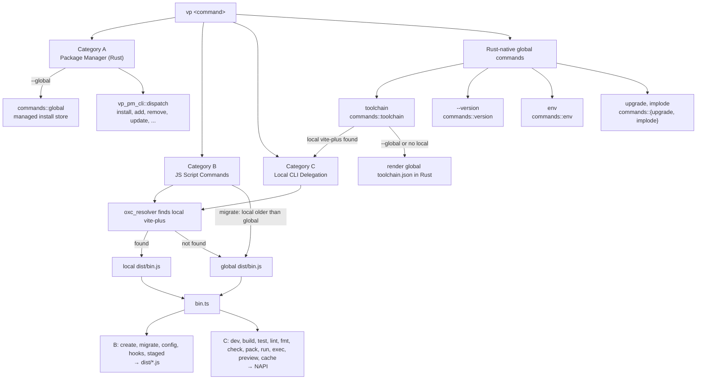

# RFC: Merge Global and Local CLI into a Single Package

## Background

Previously, the CLI was split across two npm packages:

- **`vite-plus`** (`packages/cli/`) — The local CLI, installed as a project devDependency. Handles build, test, lint, fmt, run, and other task commands via NAPI bindings to Rust.
- **`vite-plus-cli`** (`packages/global/`) — The global CLI, installed to `~/.vite-plus/`. Handles create, migrate, version, and package manager commands. Had its own NAPI binding crate, rolldown build, install scripts, and snap tests.

The Rust binary `vp` (`crates/vp_global_cli/`) acted as the entry point, delegating to `packages/global/dist/index.js` which detected the local `vite-plus` installation and forwarded commands accordingly.

**Problems with the two-package approach:**

1. Two separate NAPI binding crates with overlapping dependencies
2. Two separate build pipelines (tsc for local, rolldown for global)
3. Two npm packages to publish and version
4. A JS shim layer (`dist/index.js`) for detecting/installing local vite-plus
5. Complex CI workflows to build, test, and release both packages
6. Duplicated utilities and types across packages

## Goals

1. Merge `packages/global/` (`vite-plus-cli`) into `packages/cli/` (`vite-plus`)
2. Publish a single npm package: `vite-plus`
3. Unify the NAPI binding crate
4. Replace the JS shim with direct Rust resolution via `oxc_resolver`
5. Simplify CI build and release pipelines
6. Keep all existing functionality working

## Architecture (After Merge)

### Single Package: `packages/cli/` (`vite-plus`)

```
packages/cli/
├── bin/vp                    # Node.js entry script
├── binding/                  # Unified NAPI binding crate (migration, package_manager, utils)
├── src/
│   ├── bin.ts                # Unified entry point for both local and global commands
│   ├── create/               # vp create command (from global)
│   ├── migration/            # vp migrate command (from global)
│   ├── version.ts            # vp --version (from global)
│   ├── utils/                # Shared utilities (from global-utils)
│   ├── types/                # Shared types (from global-types)
│   ├── resolve-*.ts          # Local CLI tool resolvers
│   └── ...                   # Other local CLI source files
├── dist/                     # tsc output (local CLI)
│   ├── bin.js                # Compiled entry point
│   └── global/               # rolldown output (global CLI chunks)
│       ├── create.js
│       ├── migrate.js
│       └── version.js
├── install.sh / install.ps1  # Global install scripts
├── templates/                # Project templates
├── rules/                    # Oxlint rules
├── snap-tests/               # Local CLI snap tests
└── snap-tests-global/        # Global CLI snap tests
```

### Global Install Directory (`~/.vite-plus/`)

The global install directory uses a wrapper package pattern. Each version directory
declares `vite-plus` as an npm dependency instead of extracting its internals directly.
This decouples the `vp` binary from vite-plus's internal file layout.

```
~/.vite-plus/
├── bin/
│   └── vp                            # Symlink to current/bin/vp
├── current -> <version>/             # Symlink to active version
├── <version>/
│   ├── bin/
│   │   └── vp                        # Rust binary (from CLI platform package)
│   ├── package.json                  # Wrapper: { "dependencies": { "vite-plus": "<version>" } }
│   └── node_modules/
│       ├── vite-plus/                # Installed as npm dependency
│       │   ├── dist/bin.js           # JS entry point (found by Rust binary)
│       │   ├── dist/global/          # Bundled global commands
│       │   ├── binding/              # NAPI loader
│       │   ├── templates/            # Project templates
│       │   ├── rules/                # Oxlint rules
│       │   └── package.json          # Real vite-plus package.json
│       ├── @voidzero-dev/            # Platform package (via optionalDeps)
│       │   └── vite-plus-<platform>/ # Contains .node NAPI binary
│       └── [other transitive deps]
├── env, env.fish, env.ps1            # Shell PATH configuration
└── packages/                         # Globally installed packages (vp install -g)
```

**Install flows:**

- **Production** (`curl -fsSL https://vite.plus | bash`):
  Downloads CLI platform tarball from `@voidzero-dev/vite-plus-cli-{platform}` (extracts only `vp` binary),
  generates wrapper `package.json`, runs `vp install --silent` which installs `vite-plus` + all transitive deps via npm.

- **Upgrade** (`vp upgrade`):
  Downloads CLI platform tarball from `@voidzero-dev/vite-plus-cli-{platform}` (binary only),
  generates wrapper `package.json`, runs `vp install --silent`. No main tarball download needed.

- **Local dev** (`pnpm bootstrap-cli`):
  Copies `vp` binary, generates wrapper `package.json`, symlinks
  `node_modules/vite-plus` to `packages/cli/` source with transitive deps
  symlinked from `packages/cli/node_modules/`.

- **CI** (`pnpm bootstrap-cli:ci --tgz <path>`):
  Copies `vp` binary, generates wrapper `package.json` with `file:` protocol
  refs to tgz files, runs `npm install`.

### Command Routing

The Rust `vp` binary (`crates/vp_global_cli/`) parses every command with clap (`crates/vp_global_cli/src/cli.rs`) and routes it down one of the paths below:



- **Category A (Package Manager)**: `install`, `add`, `remove`, `update`, `dedupe`, `outdated`, `why`, `info`, `link`, `unlink`, `dlx`, `pm <subcmd>` — clap definitions and dispatch live in the shared `crates/vp_pm_cli/` crate. Both the global CLI and the local CLI binding flatten `vp_pm_cli::PackageManagerCommand` into their top-level argument parser and call `vp_pm_cli::dispatch` to run the underlying package manager (pnpm/npm/yarn/bun). From the global `vp` binary these commands are handled entirely in Rust by `run_package_manager_command` and never reach `bin.ts`; the NAPI path is only taken when the local JavaScript entry point is invoked directly (for example `npx vp install`). The global CLI additionally intercepts the `--global` projections (`PackageManagerCommand::managed_global_command`) and serves them from the vite-plus-managed install store in `commands::global` before delegating.
- **Category B (JS Script Commands)**: `create`, `migrate`, `config`, `hooks`, `staged` — implemented in JavaScript. Rust uses `oxc_resolver` to find the project's local `vite-plus/dist/bin.js` and runs it with the managed Node.js runtime, falling back to the global installation's `dist/bin.js` when no local installation exists. The unified `bin.ts` entry point then loads the tsdown-bundled module for the command (entries are declared in `packages/cli/tsdown.config.ts`). `migrate` is the one exception to local-first resolution: `JsExecutor::delegate_migrate` compares versions and runs the global CLI instead when the project's local `vite-plus` is older than the global `vp`.
- **Category C (Local CLI Delegation)**: `dev`, `build`, `test`, `lint`, `fmt`, `check`, `pack`, `run`, `exec`, `preview`, `cache` — forwarded to the local vite-plus CLI through `commands::delegate`, which resolves `bin.js` the same way as Category B; `bin.ts` then routes them to the NAPI binding. `lint --init` and `fmt --init`/`--migrate` are forced to the global installation (`commands::delegate::execute_global`).
- **Rust-native global commands**: the remaining top-level variants are handled in Rust by the global binary. `env`, `upgrade`, and `implode` have no local counterpart; `--version` and `toolchain` also exist in the local CLI and are reached there when the JavaScript entry point is invoked directly (for example `npx vp --version`).
  - `toolchain` (`commands::toolchain`) is a hybrid: when `--global` is absent and a project-local `vite-plus` resolves, it delegates to the local CLI like Category C; otherwise (`--global`, or no local installation) it loads and renders the global installation's `toolchain.json` directly in Rust rather than falling back through the global `bin.js`.
  - `--version` (`commands::version`) prints the `vp` binary version and the bundled tool versions directly from Rust; it never reaches `bin.ts`.
  - `env` (`commands::env`) manages Node.js versions, shims, and pins.
  - `upgrade` and `implode` (`commands::upgrade`, `commands::implode`) are the self-management commands for the `vp` binary and its install directory.

### Global scripts_dir Resolution (Rust)

The `vp` binary auto-detects the JS scripts directory from its own location:

```rust
// Auto-detect from binary location
// ~/.vite-plus/<version>/bin/vp -> ~/.vite-plus/<version>/node_modules/vite-plus/dist/
let exe_path = std::env::current_exe()?;
let bin_dir = exe_path.parent()?;           // ~/.vite-plus/<version>/bin/
let version_dir = bin_dir.parent()?;        // ~/.vite-plus/<version>/
let scripts_dir = version_dir.join("node_modules").join("vite-plus").join("dist");
```

### Local vite-plus Resolution (Rust)

```rust
// Uses oxc_resolver to resolve vite-plus/package.json from the project directory
// If found and dist/bin.js exists, runs the local installation
// Otherwise falls back to the global installation's dist/bin.js
fn resolve_local_vite_plus(project_path: &AbsolutePath) -> Option<AbsolutePathBuf> {
    let resolver = Resolver::new(ResolveOptions {
        condition_names: vec!["import".into(), "node".into()],
        ..ResolveOptions::default()
    });
    let resolved = resolver.resolve(project_path, "vite-plus/package.json").ok()?;
    let pkg_dir = resolved.path().parent()?;
    let bin_js = pkg_dir.join("dist").join("bin.js");
    if bin_js.exists() { AbsolutePathBuf::new(bin_js) } else { None }
}
```

### Unified Entry Point (`bin.ts`)

```typescript
// Global commands — handled by rolldown-bundled modules in dist/global/
if (command === 'create') {
  await import('./global/create.js');
} else if (command === 'migrate') {
  await import('./global/migrate.js');
} else if (command === '--version' || command === '-V') {
  await import('./global/version.js');
} else {
  // All other commands — delegate to Rust core via NAPI binding
  run({ lint, pack, fmt, vite, test, doc, resolveUniversalViteConfig, args });
}
```

## Changes Summary

### Completed

1. **Merged all source code** from `packages/global/` into `packages/cli/`:
   - `src/create/`, `src/migration/`, `src/version.ts` — Global commands
   - `src/utils/`, `src/types/` — Shared utilities and types (renamed from `global-utils`, `global-types`)
   - `binding/` — Unified NAPI crate with migration, package_manager, utils modules
   - `install.sh`, `install.ps1` — Install scripts
   - `templates/`, `rules/` — Assets
   - `snap-tests-global/` — Global snap tests

2. **Deleted `packages/global/`** entirely

3. **Updated Rust `vp` binary** (`crates/vp_global_cli/`):
   - Added `oxc_resolver` dependency for direct local vite-plus resolution
   - Removed JS shim layer — no more `dist/index.js` intermediary
   - Updated all command entry points from `index.js` to `bin.js`
   - Changed `MAIN_PACKAGE_NAME` from `vite-plus-cli` to `vite-plus`
   - Scripts dir resolution: `version_dir/node_modules/vite-plus/dist/`

4. **Restructured global install directory** (`~/.vite-plus/<version>/`):
   - Wrapper `package.json` declares `vite-plus` as a dependency
   - `vite-plus` installed into `node_modules/` by npm (not extracted from tarball)
   - `.node` NAPI binaries installed via npm optionalDependencies (not manually copied)
   - Removed `extract_main_package()`, `strip_dev_dependencies()`, `MAIN_PACKAGE_ENTRIES`
   - Added `generate_wrapper_package_json()` for upgrade command
   - Simplified install scripts: only extract `vp` binary + generate wrapper
   - Simplified `install-global-cli.ts`: symlink-based local dev, wrapper-based CI

5. **Updated build system**:
   - Added `rolldown.config.ts` to bundle global CLI modules into `dist/global/`
   - `treeshake: false` required for dynamic imports
   - Plugin to fix binding import paths in rolldown output
   - Simplified root `package.json` build scripts (removed global package steps)

6. **Updated CI/CD**:
   - Simplified `build-upstream` action (removed global package build steps)
   - Simplified `release.yml` (removed global package publish, now 3 packages instead of 4)
   - `get_cli_version()` reads from `node_modules/vite-plus/package.json`

7. **Removed `vite` bin alias** — Only `vp` binary entry remains

8. **Updated package.json**:
   - Added runtime deps: `cross-spawn`, `picocolors`
   - Added devDeps from global: `semver`, `yaml`, `glob`, `minimatch`, `mri`, etc.
   - Added `snap-test-global` script
   - Added `files` entries: `AGENTS.md`, `rules`, `templates`

9. **Updated documentation**: `CLAUDE.md`, `CONTRIBUTING.md`

10. **Separated `vp` binary into dedicated CLI platform packages**:
    - `@voidzero-dev/vite-plus-{platform}` packages now contain only the `.node` NAPI binding (~20MB)
    - `@voidzero-dev/vite-plus-cli-{platform}` packages contain only the `vp` Rust binary (~5MB)
    - `publish-native-addons.ts` creates and publishes both NAPI and CLI packages separately
    - Install scripts (`install.sh`, `install.ps1`) construct CLI package suffix directly instead of querying optionalDependencies
    - Upgrade registry (`registry.rs`) queries CLI packages directly instead of looking up optionalDependencies
    - Reduces download size for `npm install vite-plus` (no longer includes unused `vp` binary)

11. **Brought all PM commands to the local CLI** via a shared `vp_pm_cli` crate:
    - Extracted clap definitions and dispatcher for every PM command (`install`, `add`, `remove`, `update`, `dedupe`, `outdated`, `why`, `info`, `link`, `unlink`, `dlx`, `pm <subcmd>`) into `crates/vp_pm_cli/`. Both `vp_global_cli` and the `packages/cli/binding/` NAPI crate flatten `PackageManagerCommand` into their top-level argument parser and call `vp_pm_cli::dispatch`.
    - Previously the local CLI binding only knew the `install` shortcut; every other PM command produced clap's "unknown subcommand" error. Now `npx vp add <pkg>`, `vp remove`, `vp pm publish`, etc. all work identically on global and local.
    - The global CLI keeps a thin wrapper for `--global` paths (`commands::env::global_install`) that intercepts before delegating to `vp_pm_cli::dispatch`. The local CLI delegates directly and bypasses the vite-task scheduler since PM operations don't need caching.
    - Deleted per-command modules `crates/vp_global_cli/src/commands/{add,remove,install,update,dedupe,outdated,why,link,unlink,dlx,pm}.rs`.
    - Mirrored one representative pnpm10 fixture per command into `packages/cli/snap-tests/` to lock in parity.

## Verification

- `cargo test -p vp_global_cli` — Rust unit tests pass
- `pnpm -F vite-plus snap-test-local` — Local CLI snap tests pass
- `pnpm -F vite-plus snap-test-global` — Global CLI snap tests pass
- `pnpm bootstrap-cli` — Full build and global install succeeds
- `VP_VERSION=test bash packages/cli/install.sh` — Production install from npm works
- Manual testing: `vp create`, `vp migrate`, `vp --version`, `vp build`, `vp test` all work
