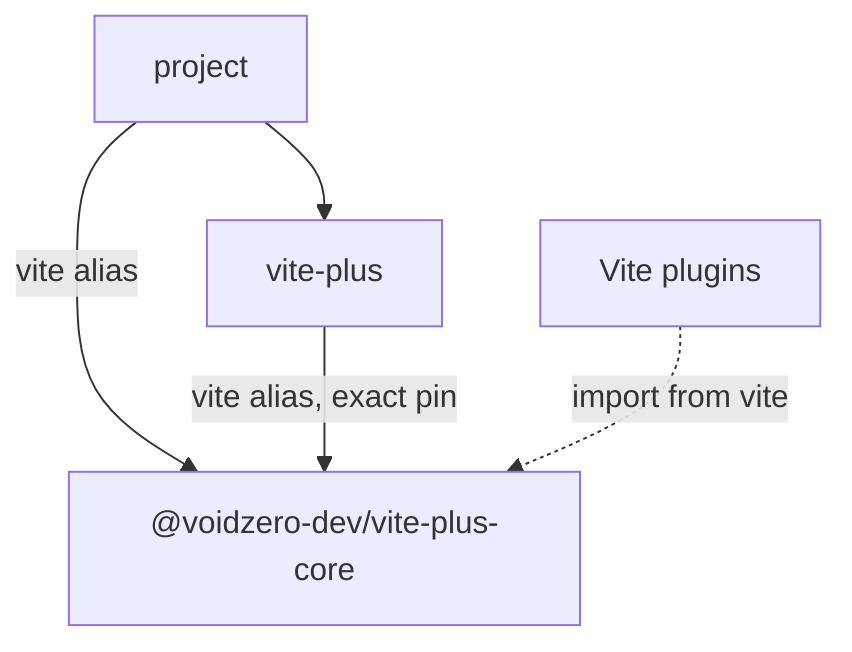

# RFC: Share the Vite Core Runtime Through One Dependency Name

- Status: Proposed
- Issue: [#1391](https://github.com/voidzero-dev/vite-plus/issues/1391)
- Related: [Core package bundling](../packages/core/BUNDLING.md),
  [CLI package bundling](../packages/cli/BUNDLING.md),
  [Core binding resolution](./core-binding-resolution.md)

## Proposal

Use `vite` as the dependency name for the core runtime throughout `vite-plus`.
The CLI will depend on an exact alias to `@voidzero-dev/vite-plus-core`. Its
runtime imports, public re-exports, and generated shims will use that alias.

This applies the dependency change suggested in #1391 to the CLI's API surface
as well as its command resolver. User plugins and the CLI can then resolve the
same dependency under the same name.

## Problem

A migrated project can have this manifest:

```json
{
  "devDependencies": {
    "vite": "npm:@voidzero-dev/vite-plus-core@0.3.0",
    "vite-plus": "0.3.0"
  },
  "overrides": {
    "vite": "npm:@voidzero-dev/vite-plus-core@0.3.0"
  }
}
```

The `vite-plus` package also depends on `@voidzero-dev/vite-plus-core` under its
published name. Bun installs two copies:

```text
node_modules/vite/                          # project's alias
node_modules/@voidzero-dev/vite-plus-core/  # CLI's dependency
```

Node loads these paths as separate modules even though the package versions
match. `vp dev` creates the server through the second copy. TanStack Start
imports `isRunnableDevEnvironment` from the first copy through `vite`.

Vite implements the guard with `environment instanceof RunnableDevEnvironment`.
The constructor belongs to a different module instance, so the guard returns
`false`. TanStack skips its SSR middleware, and requests to `/` return HTTP 404
with `Cannot GET /`.

The public `vite-plus` entry point also re-exports the second copy. Changing
the command resolver to start the first copy reverses the mismatch: TanStack's
guard passes, but the guard exported by `vite-plus` fails.

## Goals and scope

For a project with matching Vite+ versions and compatible peer dependencies,
`vp dev`, imports from `vite`, and Vite APIs exported by `vite-plus` must share
one core runtime. The same rule applies to ESM, CommonJS, and the module-runner
exports.

The CLI must use its declared core dependency without depending on a hoisted
copy under the canonical package name. A project that uses `vite-plus` alone
must retain access to the bundled commands and public APIs.

This proposal addresses duplication caused by the alias and canonical
dependency names. Package managers can still install separate versions or
peer variants under one name. The validation plan covers those layouts; this
RFC does not propose a process-wide module loader hook or constructor registry.

## Design

### Dependency declaration

Replace the CLI's core dependency in `packages/cli/package.json` with a
workspace alias:

```json
{
  "dependencies": {
    "vite": "workspace:@voidzero-dev/vite-plus-core@*"
  }
}
```

The release packer must emit an exact npm alias. For the version used in the
prototype, the packed dependency is:

```json
{
  "dependencies": {
    "vite": "npm:@voidzero-dev/vite-plus-core@0.3.0"
  }
}
```

Preview and local-registry builds must preserve their corresponding exact
core version or artifact reference. Add packing assertions for these flows;
the committed manifest must not contain a release-specific version pin.

The proposed dependency graph is:



The diagram describes the target for matching versions and peer contexts. The
package-manager integration tests must establish runtime identity in the
supported layouts.

### Imports and generated exports

Change import specifiers that refer to the CLI's core dependency from
`@voidzero-dev/vite-plus-core` to `vite`, including subpaths:

| Source                                    | Required change                                                         |
| ----------------------------------------- | ----------------------------------------------------------------------- |
| `packages/cli/src/index.ts`, `index.cts`  | Re-export Vite APIs through `vite` in both module formats               |
| `packages/cli/src/pack.ts`, `pack-bin.ts` | Import the bundled tsdown API through `vite/pack`                       |
| `packages/cli/build.ts`                   | Generate module-runner, internal, client, and type shims through `vite` |
| `packages/cli/src/define-config.ts`       | Update type imports and review the module augmentation                  |
| Migration and build metadata readers      | Resolve the declared alias when reading the CLI's core dependency       |

Separate the dependency specifier from the published package identity in build
helpers. Keep `@voidzero-dev/vite-plus-core` as the package name in npm alias
targets, version checks, registry records, and toolchain metadata. Do not apply
a repository-wide string replacement.

Review the `UserConfig` augmentation in `define-config.ts` with declaration
generation enabled. Vitest augments `vite` too, so the implementation must
check both augmentations together and retain the public Vite+ configuration
types.

### Command resolution and version checks

Resolve `vite` relative to the selected `vite-plus` package before starting a
Vite-backed command. That anchor must match the CLI's static re-exports.
Choosing a project copy first could start one runtime while the API exports
another.

The existing `resolveBundled()` helper prefers the CLI's location but permits
a project fallback. Use a resolver without that fallback for the required
core dependency. If the selected package cannot resolve its declared alias,
report the incomplete installation.

Before invoking a core-specific command entry, read the resolved
`vite/package.json` and check:

1. Its `name` is `@voidzero-dev/vite-plus-core`.
2. Its version matches the selected CLI's expected core release.
3. The command entry exists in that package.

The check must distinguish the core package version from its bundled Vite
version. For example, core `0.3.0` bundles Vite `8.2.2`.

If the active project's `vite` resolves to upstream Vite or a different core
version, report the expected and actual packages and their locations. Ask the
user to align the aliases and reinstall. A project without a resolvable
top-level `vite` may use the CLI's declared dependency. A matching version in
a different peer context needs the layout validation described below; version
equality alone does not establish module identity.

Apply these checks before the CLI starts Vite or loads its packaging entry.
Retain the distinction between pure `vite.defineConfig()` and the Vite+
configuration helper, which injects Vite+ plugins.

### Compatibility and installation

Projects retain `vite` aliases that target `@voidzero-dev/vite-plus-core`.
Upgrading the CLI and aligning the existing aliases to the same release gives
the package manager the proposed dependency graph. No new alias target is
required by this design.

The CLI's dependency remains required and exact-pinned. Replacing it with a
peer dependency would make bundled commands depend on the user's installation.

Audit the release and preview packers, local npm registry, toolchain manifest,
and migration metadata readers for canonical-name resolution assumptions.
Keep standalone core installations and their native binding resolution intact.
Consumers that import core by its published name must declare that dependency;
they cannot rely on the CLI exposing it through hoisting.

## Prototype results

The investigation used repository commit
`b87593c580ed5d7c6932f60468df474909990f96` and the
[issue reproduction](https://github.com/keyding/vite-plus-tanstack-start-ssr-broken/tree/2fc3db690c09fa877439b6d653641362e35f965e).
The experiments used published Vite+ and core `0.3.0` artifacts, bundled Vite
`8.2.2`, TanStack Start `1.168.49`, Node `24.14.1`, and macOS arm64.

The dependency prototype repacked the CLI with the alias dependency and
rewrote core references in its built files. Fresh installs produced these
results:

| Package manager | `GET /`  | Same environment guard from `vite` and `vite-plus` |
| --------------- | -------- | -------------------------------------------------- |
| Bun `1.4.2`     | HTTP 200 | Yes                                                |
| npm `11.11.0`   | HTTP 200 | Yes                                                |
| pnpm `10.30.1`  | HTTP 200 | Yes                                                |

API probes confirmed identity for `createServer`, `mergeConfig`,
`DevEnvironment`, the runnable factory, and both environment guards across
ESM and CommonJS. The module-runner exports shared `ModuleRunner` too. The
pure Vite `defineConfig()` retained its identity-function behavior.

A focused `vp test` case passed. Importing the packaging API and running
`vp pack --help` also succeeded. These experiments establish feasibility;
they did not build the proposed source changes or run full build, migration,
type, and ecosystem suites.

## Alternatives

### Change only the CLI resolver

Starting the project's alias returned HTTP 200 in the reproduction. The core
guard then returned `false`, so the CLI's public re-exports still disagreed with
the active server. The dependency and export changes are part of this RFC for
that reason.

### Shared markers in upstream Vite

Vite could mark `RunnableDevEnvironment` and `FetchableDevEnvironment` with
`Symbol.for(...)` keys and let their guards accept those markers across module
copies. A prototype retained both physical copies, passed 42 checks, and
restored HTTP 200. The checks covered both import directions, subclasses,
wrong-kind environments, and guarding without initializing the lazy runner.

This is a useful upstream improvement. It fixes those guards while leaving
other constructor identities and module state separate. Old unpatched guards
also cannot recognize a marker from another copy. Pursue it as a separate
change with an upstream compatibility policy for the symbol keys.

### Thin Vite compatibility package

A new alias target could re-export core through a declared canonical
dependency. The CLI would retain its current dependency. A forwarding-package
prototype returned HTTP 200 and shared runtime identity with Bun `1.4.2`, npm
`11.11.0`, and pnpm `11.24.0`.

That design needs a new published package, complete Vite exports and types,
client asset handling, and changes to migration and release tooling. It remains
an alternative if changing the CLI's dependency specifier causes compatibility
problems that the implementation cannot resolve.

### Alias `vite` to `vite-plus`

The alias `npm:vite-plus@0.3.0` restored SSR, but changed
`vite.defineConfig({})` into a call that returns a new object with injected
plugins. It also adds a `vite-plus` -> `vitest/config` -> `vite` import cycle.
The proposed design retains the pure Vite API at `vite`.

### Postinstall symlink repair

Pointing the canonical core directory at the alias fixes the reproduction.
Supporting that repair would require handling reinstalls, nested dependency
layouts, and package managers that do not use `node_modules`. Declare the
intended dependency graph instead of repairing it after installation.

## Implementation and validation

Implement the dependency, imports, generated shims, and resolver as one
behavior change. Splitting their rollout would expose mixed runtime identities
or imports of an undeclared dependency.

Use packed source builds through the
[local npm registry](../CONTRIBUTING.md#test-vp-migrate--vp-create-through-a-local-npm-registry).
Workspace links can conceal the alias duplication. Add CLI regressions to the
[PTY snapshot suite](../crates/vp_cli_snapshots/tests/cli_snapshots/README.md)
and API/type coverage in the corresponding package tests.

| Area                        | Required coverage                                                                                                        |
| --------------------------- | ------------------------------------------------------------------------------------------------------------------------ |
| SSR regression              | Original TanStack reproduction and latest supported TanStack; HTTP 200 and both guards pass                              |
| Module identity             | ESM, CommonJS, module-runner, and CLI-created environments share the expected APIs                                       |
| Package layouts             | Bun, npm, pnpm, Yarn with `node_modules`, Yarn PnP, pnpm global virtual store, and monorepos with separate peer contexts |
| CLI without a project alias | Install `vite-plus` alone; resolve bundled commands and public APIs from its required dependency                         |
| Invalid installations       | Missing dependency, upstream Vite override, stale core alias, and version mismatch produce actionable CLI errors         |
| Types and commands          | Generated declarations, Vite/Vitest config augmentation, `vp dev`, `vp build`, `vp preview`, `vp test`, and `vp pack`    |
| Distribution                | Release, preview, and local-registry tarballs declare the intended alias and retain standalone core binding support      |
| Upgrade                     | Reinstall an existing project with the new CLI and matching aliases; exercise migration and version synchronization      |

The release gate is a source-built install that shares runtime identity in the
supported layouts. If a package manager creates separate peer variants that
break the regression, resolve that case before shipping or revise this design.

## Open questions

1. Can the CLI's alias dependency and each plugin's Vite peer resolve to the
   same runtime across the supported monorepo and PnP layouts? The prototype
   covered single-project installs.
2. Which existing configuration types require changes when the CLI augments
   `vite` alongside Vitest? Declaration tests must settle this before release.
3. Should a separate upstream Vite change add shared environment markers even
   after this dependency change removes the duplication in #1391?
